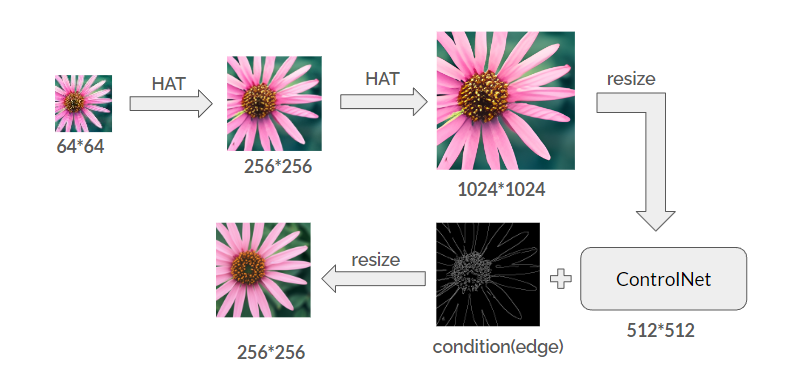
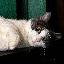
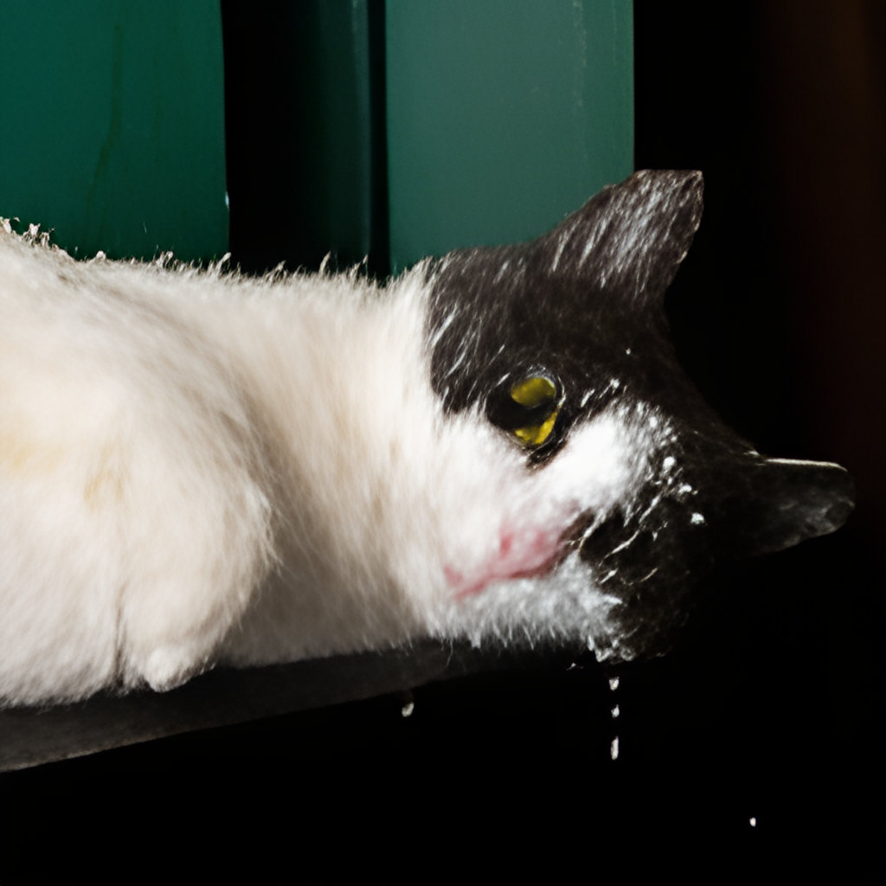
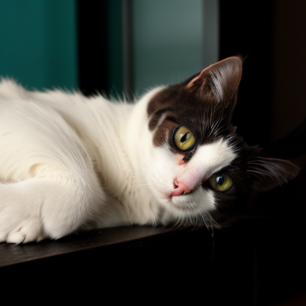
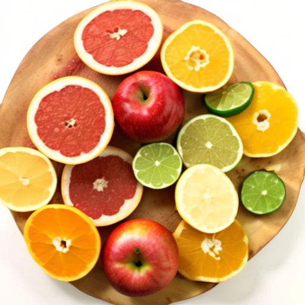

<h1 align="center">Image super resolution</h1>

## Related Work
- [ Activating More Pixels in Image Super-Resolution Transformer, CVPR 2023 ](https://github.com/XPixelGroup/HAT?tab=readme-ov-file)
- [ Adding Conditional Control to Text-to-Image Diffusion Models ](https://github.com/lllyasviel/ControlNet?tab=readme-ov-file)

## Pipeline

  

## Results

  &nbsp;&nbsp;&nbsp;
  &nbsp;&nbsp;&nbsp;
  

  &nbsp;&nbsp;&nbsp;
  &nbsp;&nbsp;&nbsp;
  

  &nbsp;&nbsp;&nbsp;
  &nbsp;&nbsp;&nbsp;
  

   
  
